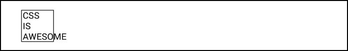

    

<h3 align="center">
	<strong>FrontBox CSS</strong> <small>by Bartosz Piwek</small>
</h3>

  Open-source static site builder tool.

	Test framework
	:
  <a href="http://dev.frontbox.bartoszpiwek.e-kei.pl/">Development</a>
  ·
  <a href="http://prod.frontbox.bartoszpiwek.e-kei.pl/">Productive</a>

 

## Information

<table>
	<tr>
		<td>HTML</td>
		<td><a href="https://pugjs.org/">Pug</a></td>
	</td>
	<tr>
		<td>CSS</td>
		<td><a href="https://sass-lang.com">SCSS</a></td>
	</td>
	<tr>
		<td>JavaScript</td>
		<td><a href="http://browserify.org">Browserify</a>/<a href="https://www.typescriptlang.org">TypeScript</a></td>
	</td>
	<tr>
		<td>Task runner</td>
		<td><a href="https://gulpjs.com">Gulp</a></td>
	</td>
	<tr>
		<td>Version</td>
		<td>1.2.0</td>
	</td>
</table>

 

## Used programs

### Requirements:
- <a href="https://nodejs.org/en/">Node.js</a> - JavaScript run-time environment
- <a href="https://gulpjs.com">Gulp</a> - The streaming build system
- <a href="https://yarnpkg.com/en/docs/install">Yarn</a> - Fast, reliable, and secure dependency management
- <a href="https://code.visualstudio.com">Visual Studio Code</a> - IDE
- <a href="https://github.com/sds/scss-lint">scss-lint</a> - Configurable tool for writing clean, consistent SCSS

### Visual Studio Code extensions:
- <a href="https://marketplace.visualstudio.com/items?itemName=adamwalzer.scss-lint">scss-lint</a> - Linter SCSS
- <a href="https://marketplace.visualstudio.com/items?itemName=sibiraj-s.vscode-scss-formatter">SCSS Formatter</a> - Format SCSS.
- <a href="https://marketplace.visualstudio.com/items?itemName=rebornix.project-snippets">Project Snippets</a> - Provide workspace/project level code snippets.

### Additional:

#### Images
- <a href="https://sourceforge.net/projects/nikkhokkho/">FileOptimizer</a> - Advanced file optimizer featuring a lossless (no quality loss) file size reduction
- <a href="https://chocolatey.org/packages/imagemagick.app">imagemagick</a> & <a href="http://www.imagemagick.org/script/download.php">MS binary</a> - Software suite to create, edit, compose, or convert bitmap images

#### Tests
- <a href="https://github.com/google/ios-webkit-debug-proxy">iOS WebKit Debug Proxy</a> - Debug iOS device
- <a href="https://www.apple.com/pl/itunes/download/">iTunes</a> - iOS drivers

#### Helpful
- <a href="https://chocolatey.org/">Chocolatey</a> - The package manager for Windows
- <a href="https://www.navicat.com/en/products/navicat-for-mysql">Navicat fo MySQL</a> - Relational database management system
- <a href="https://winscp.net">WinSCP</a> - SFTP and FTP client for Microsoft Windows

### Commands for ImageMagick:
Google Pagespeed Insights image optimization guidelines

- JPG
>convert image.jpg -sampling-factor 4:2:0 -strip -quality 85 -interlace JPEG -colorspace sRGB image@converted.jpg

- PNG
>convert image.png -strip image@converted.png

<h2>
 

## Gulp

### Terminal tasks:
<table>
	<tr>
		<td>Generate website with server and automatic update after modifying files</td>
		<td>gulp</td>
	</td>
	<tr>
		<td>Generate favicons</td>
		<td>gulp favicon</td>
	</td>
	<tr>
		<td>Create docs (<a href="https://github.com/kneath/kss" target="_blank">KSS</a>)</td>
		<td>gulp docs</td>
	</td>
	<tr>
		<td>Remove FrontBox-CSS development files</td>
		<td>gulp clean</td>
	</td>
	<tr>
		<td>Debug task</td>
		<td>gulp test</td>
	</td>
	<tr>
		<td>Change version to productive</td>
		<td>--prod</td>
	</td>

</table>

 

## Assets:

<strong>images</strong>

- src/images/favicon.png - used to generate multi favicons 
- src/images/logo.png - meta SEO logo

<strong>grunt configuration file (<i>settings/</i>)</strong>

- html_variables.json 
- javascript_variables.json

## Project tree:

### LESS Files

#### Version
<pre style="white-space: pre-wrap; font-family: monospace; line-height: 1.26;">
├─── public/                   | Compiled website
    ├─── prod/                  | Production
    └─── dev/                   | Development
</pre>

#### Settings
<pre style="white-space: pre-wrap; font-family: monospace; line-height: 1.26;">
├─── base.less                | Base settings
├─── responsive.less          | Screen sizes for responsive design & grid count
├─── colors.less              | Base & required colors
├─── fonts.less               | Fonts variables & declarations
├─── plugins.less             | Addon components
</pre>

#### Source
<pre style="white-space: pre-wrap; font-family: monospace; line-height: 1.26;">
└─── src/                     | Source code
    ├─── fonts/                 | Generated fonts (https://www.fontsquirrel.com/tools/webfont-generator)
    └─── images/                
        ├────── sprites/               | Spritesmith assets
        ├────── favicons/              | Generated favicons
        ├────── favicon.png            | Favicon image
        ├────── svg/                   | Vector assets
        ├────── logo.png               | Website logo image
</pre>

<pre style="white-space: pre-wrap; font-family: monospace; line-height: 1.26;">
└─── src/                     | Development files
    ├─── fonts/                  | Generated fonts (https://www.fontsquirrel.com/tools/webfont-generator)
    ├─── images/
    ├────── sprites/               | Spritesmith assets
    ├────── favicons/              | Generated favicons
    ├────── favicon.png            | Favicon image
    ├────── svg/                   | Vector assets
    ├────── logo.png               | Website logo image
    ├─── js/
    ├────── frontbox/              | Frontbox libraries
    ├────── frontbox.js            | Main JavaScript file
    ├────── libs/                  | Other libraries
    ├─── less/
    ├────── automatic/             | Generated LESS
    ├────── frontbox/              | Frontbox libraries
    ├────── plugins/               | Addon Frontbox libraries
    ├────── libs/                  | Other libraries
    ├────── variables/             | LESS variables
    ├────── style.less             | Main LESS file (concatenate file)
    ├─── template/               | Website files
    └────── includes/              | Website parts
</pre>

 

## Testing tools:

- <a href="https://ngrok.com/">ngrok</a> 
Secure tunnels to localhost
> $ ngrok http {website}:80

- <a href="https://www.google.pl/chrome/browser/desktop/index.html">Google Chrome</a> 
Inspect Android browser (Debug USB)
> Google Chrome > Remote devices

- <a href="https://www.mozilla.org/pl/firefox/new/">Firefox</a> 
Debug iOS device 
Set ON: Settings > Safari > Advanced > Web Inspector 
> $ ios_webkit_debug_proxy 
> Go to url: localhost:9222

- <a href="https://www.ssllabs.com/ssltest/">SSL Labs</a> 
Deep analysis of the configuration of any SSL web server on the public Internet.

## Browser extensions:

- <a href="https://chrome.google.com/webstore/detail/pixelparallel-by-htmlburg/iffnoibnepbcloaaagchjonfplimpkob">Pixel Perfect HTML</a> 
Free, super handy and light HTML vs Design comparison tool for front-end developers that will help you code pixel perfect websites with ease.
- <a href="https://chrome.google.com/webstore/detail/lighthouse/blipmdconlkpinefehnmjammfjpmpbjk">Lighthouse</a> 
Lighthouse is an open-source, automated tool for improving the performance, quality, and correctness of your web apps.
- <a href="https://chrome.google.com/webstore/detail/meta-seo-inspector/ibkclpciafdglkjkcibmohobjkcfkaef">META SEO inspector</a> 
Useful to inspect the meta data found inside web pages, usually not visible while browsing.
- <a href="https://chrome.google.com/webstore/detail/html5-outliner/afoibpobokebhgfnknfndkgemglggomo">HTML5 Outliner</a> 
Generates a navigable page outline with heading and sectioning elements
- <a href="https://chrome.google.com/webstore/detail/waspinspector-analytics-s/niaoghengfohplclhbjnjheodgkejpih/">WASP</a> 
Audit, validate and debug the data sent from their websites via tags and beacons

## Recommended bookmarks:

### Documentations

- Front-End API documentation 
Fast, offline, and free documentation browser for developers. Search 100+ docs in one web app: HTML, CSS, JavaScript, PHP, Ruby, Python, Go, C, C++…(offline)
> http://devdocs.io

### Images

- TinyPNG 
TinyPNG uses smart lossy compression techniques to reduce the file size of your PNG files.
> https://tinypng.com

 

## Development
For new project create symbolic links with function <a target="_blank" href="https://www.howtogeek.com/howto/16226/complete-guide-to-symbolic-links-symlinks-on-windows-or-linux/">mklink</a>
> mklink /J "C:\Projects\{project-folder}\src\less\frontbox" "C:\Projects\Frontbox-CSS\src\less\frontbox"

 

## Bugs

Feel free to report:
<a href="https://github.com/BartoszPiwek/FrontBox-CSS/issues/new?labels=bug">create bug issues</a>
